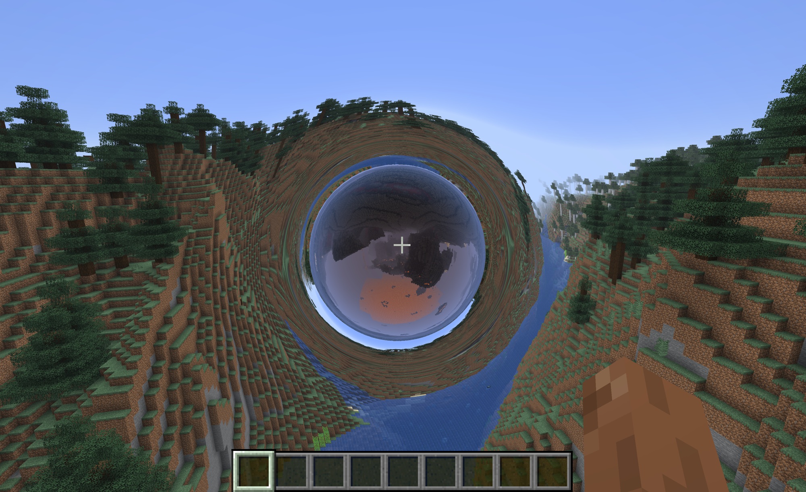

# Wormhole

> physically-real seamless portals for minecraft, built with elide

A Fabric mod that adds spherical wormhole "mouths" to the world. Link two of
them and you get a portal you can see through and walk through, into the same
dimension or across the overworld/nether boundary. The view through a mouth is
not a texture trick: it captures the far side as a live cubemap and bends the
light along real wormhole geodesics, so the window warps space the way the
*Interstellar* visual-effects team modeled it.

Crossing is seamless. Same-dimension trips are client-predicted for smoothness
and reconciled by the server. Cross-dimension trips stream the destination's
chunks ahead of time into a synthetic level and promote it on arrival, with no
loading screen.

## Structure

- [`elide.pkl`](./elide.pkl) - Project manifest; replaces `build.gradle`
- [`src/main/java`](./src/main/java) - All mod logic (`com.wormhole.*`)
- [`src/main/resources`](./src/main/resources) - `fabric.mod.json`, mixin config, and GLSL lens shaders

### Java Packages

- [`portal`](./src/main/java/com/wormhole/portal) - Portal geometry and the persistent registry: `PortalPair`, `PortalEnd`, `PortalManager`, tunnelling-safe `MouthCrossing`
- [`client`](./src/main/java/com/wormhole/client) - Client-predicted crossing detection (`ClientPortalTeleport`) and the local pair mirror (`ClientPortalStore`)
- [`server`](./src/main/java/com/wormhole/server) - Authoritative crossing reconciliation (`PortalCrossingHandler`) and cross-dimension chunk streaming (`CrossDimChunkStreamer`)
- [`client/render/lens`](./src/main/java/com/wormhole/client/render/lens) - The DNeg wormhole optics: geodesic model, baked deflection LUTs, and the through-view and around-the-mouth renderers
- [`client/render/capture`](./src/main/java/com/wormhole/client/render/capture) - Live cubemap and framebuffer capture of the far side
- [`client/render/remote`](./src/main/java/com/wormhole/client/render/remote) - Synthetic remote dimensions for the cross-dim through-view
- [`net`](./src/main/java/com/wormhole/net) - Client/server payloads for pair sync and chunk streaming
- [`mixin`](./src/main/java/com/wormhole/mixin) - Render-target, respawn, and stencil hooks

### Shaders

- [`wormhole_sphere`](./src/main/resources/assets/wormhole/shaders/core) - Through-view: samples the partner cubemap along the bent geodesic, with an Einstein-ring silhouette glow
- [`wormhole_around`](./src/main/resources/assets/wormhole/shaders/core) - Warps the surrounding scene radially around the mouth

## How it works

The lensing follows the DNeg wormhole-rendering math (James, von Tunzelmann,
Franklin & Thorne, [arXiv:1502.03809](https://arxiv.org/abs/1502.03809)).
Light geodesics are RK4-integrated through the throat and baked into deflection
LUTs, which the shaders sample per-fragment. The far side of each mouth is
captured every frame as a 6-face cubemap, so the through-view is valid in any
direction with no field-of-view limit.

For cross-dimension portals, the server streams chunk geometry and lighting
around the destination mouth into a synthetic `ClientLevel` with its own
renderer. When you cross, that pre-streamed level is promoted to live and
cached for the return trip, so the swap is invisible.

## Build

The project is built with [Elide](https://elide.dev), a single-binary build
system and runtime. It replaces the entire Gradle stack here: there is no
`build.gradle`, no `gradle/` directory, and no daemon. The whole manifest is a
few lines of [`elide.pkl`](./elide.pkl), and the JDK is bundled in the Elide
binary, so there is no separate install or `JAVA_HOME` to manage.

## Credits

Seamless-traversal and cross-dimension streaming approach ported from
[ImmersivePortals](https://github.com/qouteall/ImmersivePortals) and
SeamlessPortals. Wormhole optics based on the DNeg / *Interstellar* rendering
paper.
